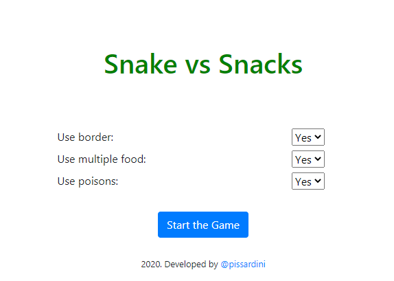
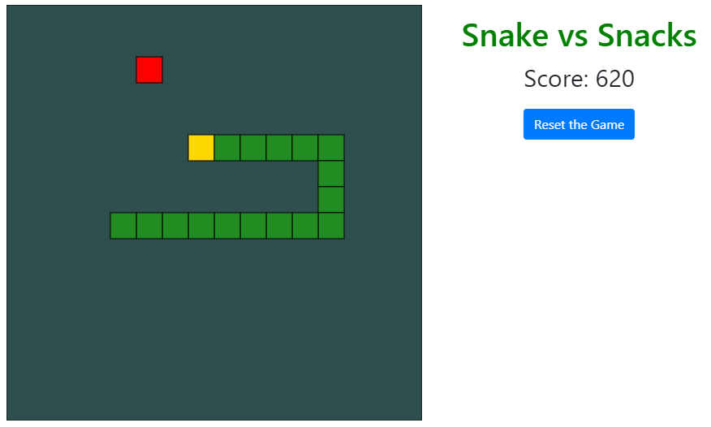

# Snake vs Snacks

A trivial snake-game written in HTML/CSS/JS. This is a basic implementation based on the lessons of Gabriela Pinheiro available on [Digital Innovation One](https://digitalinnovation.one/ "Digital Innovation One"). For the future, I plan to implement other features.

  

  

### Existent Features

* Background, snake and food functions, using canvas and JS.
* The snake has the head in a different color from the body.
* The score is changed according to the size of the snake.
* There are three initial configurations:
    - **Border**: determines whether the snake can cross the border (Yes) or not (No - game over in this case).
    - **Multiple food**: sets whether there is a multiple food (Yes) or a 
    single food (No). In both cases, the food is marked as a square in blue color.
    - **Poison**: includes (Yes) or not (No) a poison (a square in red color). A poison leads to the game over when the snake touches it.

